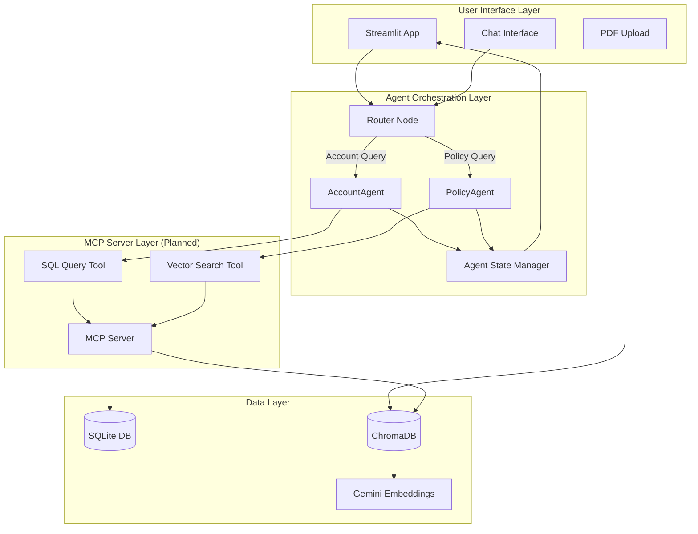

# Multi-Agent System Architecture

## System Overview

The TCS Multi-Agent Chatbot is a sophisticated AI system that combines structured database queries with semantic document retrieval to answer customer questions about accounts and insurance policies.

## Architecture Diagram



## Component Details

### 1. User Interface Layer

**Streamlit Application** (`app.py`)
- Provides web-based interface for user interactions
- Handles PDF uploads and stores them in `data/pdfs/`
- Manages chat history using session state
- Displays agent responses with formatting

**Key Features:**
- File uploader for policy PDFs
- Chat input for natural language queries
- Response streaming for real-time feedback
- Session persistence across interactions

### 2. Agent Orchestration Layer

**Router Node** (`agents/graph.py`)
- Analyzes incoming user queries
- Classifies intent (account vs. policy question)
- Routes to appropriate specialized agent
- Uses Gemini Flash for classification

**AccountAgent** (`agents/account_agent.py`)
- Specializes in customer account queries
- Generates SQL queries from natural language
- Retrieves structured data (accounts, policies, claims)
- Formats results for user consumption

**PolicyAgent** (`agents/policy_agent.py`)
- Specializes in policy document questions
- Performs semantic search over PDF content
- Implements RAG (Retrieval-Augmented Generation)
- Synthesizes answers from retrieved context

**Agent State** (`agents/state.py`)
- Maintains conversation context
- Tracks messages and agent decisions
- Stores intermediate results
- Enables multi-turn conversations

### 3. MCP Server Layer

**MCP Server** (`mcp_server/server.py`)
- Implements Model Context Protocol
- Exposes databases as standardized tools
- Handles tool invocation requests
- Provides error handling and logging

**SQL Query Tool** (`mcp_server/tools.py`)
- Executes parameterized SQL queries
- Prevents SQL injection attacks
- Returns structured results
- Validates query syntax

**Vector Search Tool** (`mcp_server/tools.py`)
- Performs similarity search in ChromaDB
- Returns top-k relevant document chunks
- Includes relevance scores
- Filters by metadata when needed

### 4. Data Layer

**SQLite Database** (`database/sqlite_manager.py`)
- Stores customer accounts
- Manages policy information
- Tracks claims and transactions
- Provides ACID guarantees

**Schema:**
```sql
customers (id, name, email, phone, account_number, created_at)
policies (id, customer_id, policy_number, type, status, premium, start_date, end_date)
claims (id, policy_id, claim_number, status, amount, filed_date, resolved_date)
```

**ChromaDB Vector Store** (`database/vector_store.py`)
- Stores PDF document embeddings
- Uses Gemini embedding model
- Supports semantic similarity search
- Persists to disk for durability

**Embedding Strategy:**
- Chunk size: 500 tokens with 50 token overlap
- Metadata: filename, page number, chunk index
- Collection per document type (policies, terms, FAQs)

## Data Flow

### Query Processing Flow

1. **User Input** → Streamlit captures query
2. **Router Analysis** → Gemini classifies intent
3. **Agent Selection** → Routes to AccountAgent or PolicyAgent
4. **Tool Invocation** → Agent calls MCP tool
5. **Data Retrieval** → MCP queries database
6. **Response Generation** → Agent synthesizes answer
7. **UI Display** → Streamlit shows response

### PDF Upload Flow

1. **User Upload** → Streamlit receives PDF
2. **Text Extraction** → PyPDF extracts content
3. **Chunking** → Split into semantic chunks
4. **Embedding** → Gemini generates vectors
5. **Storage** → ChromaDB persists embeddings
6. **Confirmation** → UI shows success message

## Agent Decision Logic

### Router Classification

```python
def classify_query(query: str) -> str:
    """
    Determines which agent should handle the query.
    
    AccountAgent triggers:
    - Customer account lookups
    - Policy status checks
    - Claim information requests
    - Premium calculations
    
    PolicyAgent triggers:
    - Coverage questions
    - Policy terms inquiries
    - Benefit explanations
    - Exclusion clarifications
    """
```

### SQL Query Generation

```python
def generate_sql(natural_language: str) -> str:
    """
    Converts natural language to SQL.
    
    Example:
    Input: "What policies does John Doe have?"
    Output: SELECT p.* FROM policies p 
            JOIN customers c ON p.customer_id = c.id 
            WHERE c.name = 'John Doe'
    """
```

### RAG Retrieval

```python
def retrieve_context(query: str, top_k: int = 3) -> List[str]:
    """
    Retrieves relevant document chunks.
    
    Process:
    1. Embed query using Gemini
    2. Similarity search in ChromaDB
    3. Rank by cosine similarity
    4. Return top-k chunks with metadata
    """
```

## Security Considerations

1. **SQL Injection Prevention**
   - Parameterized queries only
   - Input validation and sanitization
   - Query allowlist for common patterns

2. **Data Privacy**
   - No PII in logs
   - Secure API key management
   - Environment variable configuration

3. **Access Control**
   - MCP server authentication (future)
   - Rate limiting on API calls
   - Session-based isolation

## Scalability Considerations

1. **Database Performance**
   - SQLite suitable for < 100k records
   - ChromaDB indexes for fast retrieval
   - Connection pooling for concurrency

2. **Model Optimization**
   - Gemini Flash for low latency
   - Batch embedding generation
   - Response caching for common queries

3. **Future Enhancements**
   - PostgreSQL for production scale
   - Redis for session management
   - Kubernetes deployment for MCP server

## Technology Choices

| Component | Technology | Rationale |
|-----------|-----------|-----------|
| Agent Framework | LangGraph | Native multi-agent support, state management |
| LLM | Gemini 1.5 Flash | Fast inference, cost-effective, good reasoning |
| SQL Database | SQLite | Embedded, zero-config, sufficient for demo |
| Vector Database | ChromaDB | Simple API, local-first, Python-native |
| Interface | Streamlit | Rapid prototyping, built-in widgets |
| Protocol | MCP | Standardized tool interface, future-proof |

## Development Workflow

1. **Local Development**
   ```bash
   # Start MCP server
   python mcp_server/server.py
   
   # Run Streamlit app
   streamlit run app.py
   ```

2. **Testing**
   ```bash
   # Initialize test data
   python database/seed_data.py
   
   # Upload sample PDFs via UI
   # Test queries through chat interface
   ```

3. **Deployment**
   - Streamlit Cloud for UI
   - Cloud Run for MCP server
   - Cloud Storage for PDF persistence
   - Cloud SQL for production database
