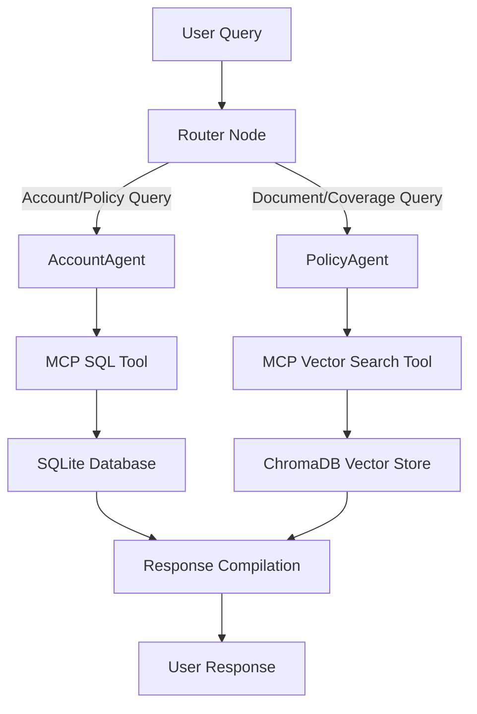

# TCS Multi-Agent Chatbot System

## Project Structure

```
tcs-chatbot/
├── agents/                      # Agent implementations
│   ├── __init__.py
│   ├── account_agent.py        # SQL-based customer account agent
│   ├── policy_agent.py         # RAG-based policy document agent
│   ├── graph.py                # LangGraph workflow orchestration
│   └── state.py                # Shared agent state definitions
│
├── database/                    # Data layer
│   ├── __init__.py
│   ├── schema.sql              # SQLite database schema
│   ├── sqlite_manager.py       # SQLite connection and query manager
│   ├── vector_store.py         # ChromaDB vector store manager
│   └── seed_data.py            # Sample data initialization
│
├── mcp_server/                  # Model Context Protocol server
│   ├── __init__.py
│   ├── server.py               # MCP server implementation
│   └── tools.py                # Tool definitions (SQL & Vector search)
│
├── utils/                       # Utility functions
│   ├── __init__.py
│   ├── pdf_processor.py        # PDF text extraction and chunking
│   └── prompts.py              # Prompt templates for agents
│
├── config/                      # Configuration
│   ├── __init__.py
│   └── settings.py             # Centralized settings management
│
├── data/                        # Data storage
│   ├── pdfs/                   # Uploaded policy PDFs
│   ├── embeddings/             # ChromaDB persistence
│   └── customers.db            # SQLite database
│
├── .streamlit/                  # Streamlit configuration
│   └── config.toml
│
├── app.py                       # Streamlit UI application
├── requirements.txt             # Python dependencies
├── .env.example                 # Environment variable template
├── README.md                    # Setup and usage documentation
└── ARCHITECTURE.md              # System architecture documentation
```

## Architecture Overview

### System Components

1. **LangGraph Multi-Agent System**
   - Router node for intelligent query classification
   - AccountAgent for structured SQL queries
   - PolicyAgent for RAG-based document retrieval
   - State management for conversation context

2. **Data Layer**
   - SQLite: Customer accounts, policies, claims
   - ChromaDB: Vector embeddings of policy PDFs
   - Gemini embeddings for semantic search

3. **MCP Server**
   - Exposes databases as standardized tools
   - SQL query tool with parameterization
   - Vector search tool with similarity ranking
   - RESTful API for agent integration

4. **Streamlit Interface**
   - PDF upload and ingestion
   - Chat-based query interface
   - Real-time agent response streaming
   - Session state persistence

### Agent Workflow



## Key Features

- **Intelligent Routing**: Automatically classifies queries to the appropriate agent
- **Natural Language SQL**: Converts user questions to SQL queries
- **Semantic Search**: RAG-based retrieval from policy documents
- **MCP Integration**: Standardized tool interface for database access
- **Gemini Flash**: Fast, efficient LLM for agent reasoning
- **Interactive UI**: User-friendly Streamlit interface

## Technology Stack

- **Framework**: LangGraph for agent orchestration
- **LLM**: Google Gemini 3 Flash (gemini-3-flash-preview)
- **Databases**: SQLite (structured), ChromaDB (vector)
- **Interface**: Streamlit
- **Protocol**: MCP (Model Context Protocol)
- **Language**: Python 3.10+

## Next Steps

1. Review the [implementation plan](file:///Users/joshua_ndala/.gemini/antigravity/brain/70de0891-899d-4891-af2f-7875f6d53e87/implementation_plan.md)
2. Confirm MCP server architecture approach
3. Provide Google API key for Gemini integration
4. Begin implementation of core components
